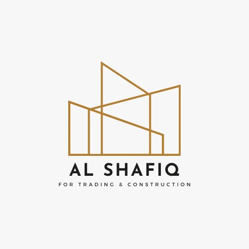

A modern and responsive website built for **El Shafiq Construction & Trading**, a company specializing in construction and trading services.  
The website showcases the company’s profile, services, projects, and contact information in a professional Arabic interface.

---

## 🌐 Overview

This project was developed using **Next.js** with the App Router architecture to provide a fast, SEO-friendly, and modular experience.  
The design follows a clean Arabic layout that reflects professionalism and clarity.  
All content is structured into separate reusable sections, making it easy to manage or expand in the future.

---

## 🛠️ Technologies Used

- **Next.js 14** → Framework for React with server-side rendering and routing  
- **React.js** → Component-based UI library  
- **Tailwind CSS** → Utility-first CSS framework for modern and responsive design  
- **React Icons** → For elegant and lightweight icons  
- **Google Maps Embed** → Integrated company location map  

---

## ✨ Key Features

- 🌍 Fully **Arabic interface** with RTL layout  
- 📱 **Responsive design** for all screen sizes  
- ⚡ **Fast performance** using Next.js optimization  
- 🧩 **Modular structure** (each section is an independent component)  
- 📞 **Contact integration** via WhatsApp and phone links  
- 📍 **Google Maps embedded** for easy navigation  
- 🎨 **Clean and modern UI** with consistent colors and typography  

---

## 📂 Project Structure

